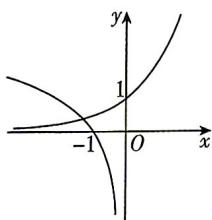
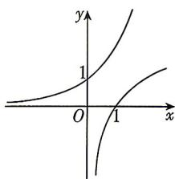
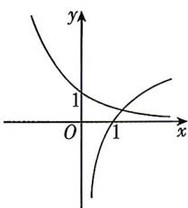
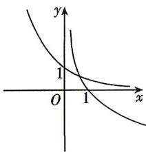

<!-- question-source:start -->
6.（多选）[四川成都2026高一学情检测]已知 $\log_{\frac{1}{2^{\frac{1}{b}}}}2^{a} = 1(a > 0, a \neq 1, b > 0, b \neq 1)$ ，则函数 $y = \left(\frac{1}{a}\right)^x$ 与 $y = \log_b x$ 的图象可能是 （）

B

A

C

D
<!-- question-source:end -->

![[Q00083974A1]]
