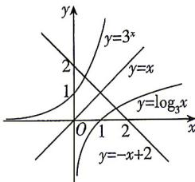

> [!faq]- 答案与解析
>
> > [!success]- **【答案】** 2
>
> > [!note]- **【解析】**
> > 由 $a+3^{a}=b+\log_{3}b=2$ ，可得 $3^{a}=-a+2,\log_{3}b=-b+2,$ 所以 a,b 分别为直线 $y=-x+2$ 与 $y=3^{1}$ 和 $y=\log_{3}x$ 图象交点的横坐标.
> > 因为 $y=3^{x}$ 和 $y=\log_{3}x$ 的图象关于直线 y=x 对称，
> > → 散黑板： $y=3^{x}$ 和 $y=\log_{3}x$ 互为反函数如图所示，则 $y=3^{x}$ 的图象与直线 $y=-x+2$ 的交点和 $y=\log_{3}x$ 的图象与直线 y=-x+2 的交点关于直线 y=x 对称.
> > 联立 $\left\{\begin{aligned}y&=-x+2,\\ y&=x,\end{aligned}\right.$ 解得 $\left\{\begin{aligned}x&=1,\\ y&=1,\end{aligned}\right.$ 所以 $\frac{a+b}{2}=1$ ，可得 a+b=2.
> >
> > 
> >
> > ## 刷易错
> >
> > ★易错点1 忽略对底数的讨论(导致单调性的不同)而致错
