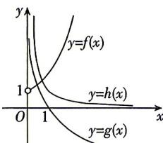

> [!faq]- 答案与解析
>
> > [!success]- **【答案】** ABC
>
> > [!note]- **【解析】**
> > ABC 【解析】作出三个函数在区间(0, +∞)上的图象,如图所示,
> >
> > 
> >
> > 根据指数函数、对数函数及幂函数的图象和性质可知在区间 $(0, +\infty)$ 上， $f(x)$ 的递增速度越来越快，故A正确；
> >
> > $g(x)$ 的递减速度越来越慢，故B正确； $h(x)$ 的递减速度越来越慢，故C正确； $g(x)$ 的递减速度快于 $h(x)$ 的递减速度，故D错误.
> >
> > 故选 **ABC**.
