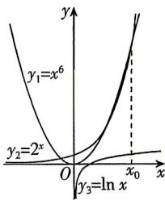

> [!faq]- 答案与解析
>
> > [!success]- **【答案】** ABC
>
> > [!note]- **【解析】**
> > ABC 【解析】在同一平面直角坐标系内作出函数 $y_{1}=x^{6}, y_{2}=2^{x}, y_{3}=\ln x$ 的图象，如图所示，
> >
> > 
> >
> > 由图象知，对任意的 $x > 0, y_1 > y_3, y_2 > y_3$ ，A，B选项正确；由于函数 $y_2 = 2^x$ 呈爆炸式增长，当 $x$ 增大到一定程度后， $y_2 = 2^x$ 的函数值将会超过 $y_1 = x^6$ 的函数值，并一直持续，即一定存在 $x_0$ ，当 $x > x_0$ 时，总有 $y_2 > y_1 > y_3$ ，C正确；当 $x \leqslant 0$ 时， $y_1 = x^6$ 与 $y_2 = 2^x$ 的图象有一个交点，当 $x > 0$ 时， $y_1 = x^6$ 与 $y_2 = 2^x$ 的图象有两个交点，所以 $y_1 = x^6$ 与 $y_2 = 2^x$ 的图象一共有三个交点，D错误。
> >
> > 故选 **ABC**.
