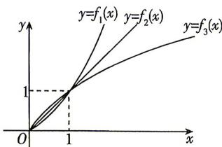

> [!faq]- 答案与解析
>
> > [!success]- **【答案】** BCD
>
> > [!note]- **【解析】**
> > BCD 【解析】作出函数 $f_{i}(x)$ (i=1,2,3) 的大致图象如图所示.
> >
> > 
> >
> > 当 $x > 1$ 时， $f_{1}(x) > f_{2}(x) > f_{3}(x)$ ，即甲在最前面，丙在最后面，A错误，B正确；当 $0 < x < 1$ 时， $f_{3}(x) > f_{2}(x) > f_{1}(x)$ ，即甲在最后面，丙在最前面，C，D正确.故选BCD.
> >
> > ## 刷 易错
> >
> > ★ 易错点 忽略函数图象增长的快慢而致错
