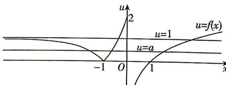

> [!faq]- 答案与解析
>
> > [!success]- **【答案】** A
>
> > [!note]- **【解析】**
> > A 【解析】令 $u = f(x)$ , 由 $[f(x)]^2 - (a + 1)f(x) + a = 0$ , 可得 $u^2 - (a + 1)u + a = 0$ , 即 $(u - a)(u - 1) = 0$ , 解得 $u = 1$ 或 $u = a$ . 当 $x \leqslant -1$ 时, $x + 1 \leqslant 0$ , $f(x) = |3^{x+1} - 1| = 1 - 3^{x+1} \in [0, 1)$ , 当 $-1 < x \leqslant 0$ 时, $0 < x + 1 \leqslant 1$ , $f(x) = |3^{x+1} - 1| = 3^{x+1} - 1 \in (0, 2]$ , 作出函数 $u = f(x)$ 的图象如图所示:
> >
> > 
> >
> > 由图可知, 直线 u=1 与函数 $u=f(x)$ 的图象有两个交点,
> > 又因为原方程有五个不同的实数根, 所以直线 u=a 与函数 $u=f(x)$ 的图象有三个交点, 由图可得 0<a<1, 故实数 a 的取值范围为 $(0,1)$ . 故选 A.
> > 名师点拨 本题关键在于将方程根的个数问题转化为两个函数图象交点个数的问题, 画出对应函数图象可实现问题求解.
