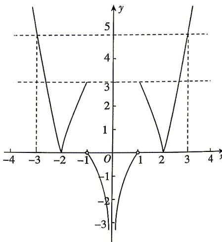

> [!faq]- 答案与解析
>
> > [!success]- **【答案】** BD
>
> > [!note]- **【解析】**
> > BD 【解析】由题意, 函数 $f(x)$ 的图象如图所示.
> > → 点 悟: 分段函数的零点问题, 画出图象会更直观
> > 对于 A, $f(x)$ 在 $(1,2)$ 上单调递减, A 错误.
> > 对于 B, 令 $f(x)=0$ , 即 $\left|4-x^{2}\right|=0$ , 解得 $x=\pm2$ , $f(x)$ 只有两个零点, B 正确.
> > 对于 C, 由图可令 $f(x)=3$ , 即 $\left|4-x^{2}\right|=3$ , 所以 $4-x^{2}=3$ 或 $4-x^{2}=-3$ , 解得 $x=\pm1$ 或 $x=\pm\sqrt{7}$ , 结合 $f(x)$ 的图象可得不等式 $f(x)\leqslant3$ 的解集为 $[- \sqrt{7},0)\cup(0,\sqrt{7}]$ , C 错误.
> > 对于 D, $f(f(x))=5$ , 即 $\left|4-\left[f(x)\right]^{2}\right|=5$ , 解得 $f(x)=\pm3$ . 若 $f(x)=3$ , 即 $\left|4-x^{2}\right|=3$ , 解得 $x=\pm1$ 或 $x=\pm\sqrt{7}$ ; 若 $f(x)=-3$ , 即 $\log_{2}|x|=-3$ , 解得 $x=\pm\frac{1}{8}$ , D 正确. 故选 BD.
> >
> > 
