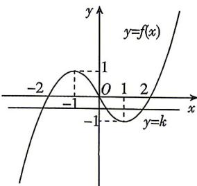

> [!faq]- 答案与解析
>
> > [!success]- **【答案】** ABD
>
> > [!note]- **【解析】**
> > ABD 【解析】对于 A, $f(1)=1^{2}-2\times1=-1$ , 所以 A 正确.
> > 对于 B, 当 x<0 时, -x>0, 所以 $f(-x)=(-x)^{2}-2(-x)=x^{2}+2x$ . 因为函数 $f(x)$ 是定义在 R 上的奇函数, 所以 $f(x)=-f(-x)=-x^{2}-2x$ , 所以 B 正确.
> > 对于 C, 当 $x \geqslant 0$ 时, $f(x) = x^{2} - 2x = (x - 1)^{2} - 1$ , 所以函数 $f(x)$ 在 $[0,1]$ 上单调递减, 在 $[1,+\infty)$ 上单调递增; 当 x<0 时, $f(x) = -x^{2} - 2x = -(x + 1)^{2} + 1$ , 所以函数 $f(x)$ 在 $[-1,0]$ 上单调递减, 在 $(-∞,-1]$ 上单调递增, 所以函数 $f(x)$ 的单调递减区间是 $[-1,1]$ , 所以 C 错误.
> > 对于 D, 由 C 知, 函数 $f(x)$ 在 $[-1,1]$ 上单调递减, 在 $(-∞,-1]$ 和 $[1,+∞)$ 上单调递增, 且 $f(-1)=1, f(1)=-1$ , 当 $x \to +∞$ 时, $f(x) \to +∞$ , 当 $x \to -∞$ 时, $f(x) \to -∞$ , 所以 $f(x)$ 的简图如图所示, 因为方程 $f(x)=k$ 有三个不同的实数根, 所以 y=f(x) 的图象与直线 y=k 有三个交点, 所以 -1<k<1, 所以 D 正确. 故选 ABD.
> >
> > 
