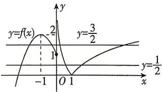

> [!faq]- 答案与解析
>
> > [!success]- **【答案】** B
>
> > [!note]- **【解析】**
> > B【解析】由 $y = 4[f(x)]^2 -8f(x) + 3 =$ 0,得 $f(x) = \frac{1}{2}$ 或 $f(x) = \frac{3}{2}$ 作出函数 $f(x)$ 的大致图象如图所示：
> >
> > 
> >
> > 由图可知, 函数 $f(x)$ 的图象与直线 $y=\frac{1}{2}$ 和直线 $y=\frac{3}{2}$ 一共有 7 个交点,
> > 所以函数 $y=4[f(x)]^{2}-8f(x)+3$ 有 7 个零点. 故选 B.
> >
> > 刷易错
> > ★易错点1 不能正确理解函数零点的概念而致错
