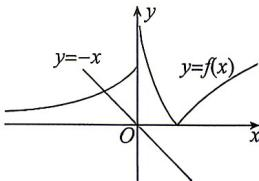
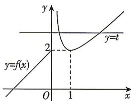

> [!faq]- 答案与解析
>
> > [!success]- **【答案】** D
>
> > [!note]- **【解析】**
> > D 【解析】当 a=0 时, $f(x)=4x-1$ , 令 $f(x)=0$ , 则 $x=\frac{1}{4}$ , 满足题意.
> > 当 $a \neq 0$ 时，若 $f(1)f(-1)=(a+3)(a-5)<0$ ，即 -3<a<5 且 $a \neq 0$ ，此时满足题意；
> > 若 $f(-1)=a-5=0$ ，即 a=5，则 $f(x)=5x^{2}+4x-1=(5x-1)(x+1)=0$ 此时方程在 $(-1,1)$ 上只有一根 $x=\frac{1}{5}$ ，满足题意；
> > 若 $f(1)=a+3=0$ ，即 a=-3，则 $f(x)=-3x^{2}+4x-1=-(3x-1)(x-1)=0$ 此时方程在 $(-1,1)$ 上只有一根 $x=\frac{1}{3}$ ，满足题意；
> > 若 $\Delta=16+4a=0$ ，即 a=-4，则 $f(x)=-4x^{2}+4x-1=-(2x-1)^{2}=0$ 此时方程的根为 $x=\frac{1}{2}$ ，满足题意.
> > 综上，实数 a 的取值范围为 $\{-4\}\cup[-3,5]$ . 故选 D.
> >
> > ★易错点4 不能正确使用等价转化而致错19.B【解析】画出 $f(x)$ 的大致图象如图所示. $g(x)$ 有且仅有一个零点等价于方程 $f(x) = -x$ 有且仅有一个解，结合 $y = f(x)$ 的图象与 $y = -x$ 的图象可知，当 $\mathrm{e}^0 +a\geqslant 0$ 即 $a\geqslant -1$ 时， $y = f(x)$ 的图象与 $y = -x$ 的图象有唯一的交点.故选B.
> >
> > 
> >
> > 思路导引 根据给定条件,先尝试画出函数 $y=f(x)$ 的图象. 再令 $f(x)=t$ , 则转化为 $h(t)=t^{2}+4t+a$ 关于 t 有两个零点, 其中一个零点 $t_{1}$ 满足 $f(x)=t_{1}$ 只有一根, 且 $t_{1}<2$ ; 而另一零点 $t_{2}$ 满足 $f(x)=t_{2}$ 有两根, 且 $t_{2}\geqslant2$ , 从而满足题意, 再根据二次函数零点分布的规律和函数零点存在定理求出实数 a 的取值范围.
> >
> > 【解析】当 $x\leqslant0$ 时, 函数 $f(x)=x+2$ 在 $(-∞,0]$ 上单调递增, $f(x)\leqslant f(0)=2$ .
> >
> > 当 x>0 时, 函数 $f(x)=x+\frac{1}{x}\geqslant2\cdot\sqrt{x\cdot\frac{1}{x}}=2$ , 当且仅当 x=1 时取等号, 函数 $y=f(x)$ 的大致图象如图所示.
> >
> > 
> >
> > 令 $f(x) = t$ ，观察图象知，当 $t < 2$ 时，方程 $f(x) = t$ 有一个根，当 $t\geqslant 2$ 时，方程 $f(x) = t$ 有两个不等根.函数 $g(x) = [f(x)]^2 +4f(x) + a(a\in \mathbf{R})$ 有三个零点，等价于函数 $h(t) = t^2 +4t + a$ 有两个零点 $t_1,t_2$ ，并满足 $t_1 <   2,t_2\geqslant 2$ ，而函数 $h(t)$ 图象的对称轴为直线 $t = -2$ ，于是得 $h(2) = a + 12\leqslant 0$ ，解得 $a\leqslant -12$ ，所以实数 $a$ 的取值范围为 $(- \infty , - 12]$ .故选D.
> >
> > 易错警示 与复合函数有关的函数或方程问题,需运用整体思想,将所求方程看成是关于 $f(x)$ 的一元二次方程,解决形如 $g(x)=[f(x)]^{2}+bf(x)+c$ 的函数的零点个数或根据函数的零点个数求参数的取值范围问题时,可采用换元法,先令 $f(x)=t$ ,求解当 $h(t)=t^{2}+bt+c=0$ 时t的值,然后根据 $f(x)$ 的图象及性质确定当 $f(x)=t$ 时,x的值的个数即为 $g(x)=[f(x)]^{2}+bf(x)+c$ 的零点个数.
> >
> > ★易错点5 不能正确理解题意而致错
