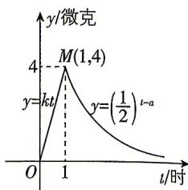

<!-- question-source:start -->
4. (多选)[河南安阳一中2026高一月考]某医药研究机构研发了一种新药, 据监测, 如果患者每次按规定的剂量注射该药物, 注射后每毫升血液中的含药量 $y$ (单位: 微克) 随时间 $t$ (单位: 时) 变化的图象近似符合如图所示的曲线. 据进一步测定, 当每毫升血液中含药量不少于0.125微克时, 治疗该病有效, 则下列说法正确的是 ( )

A. $a = 3$ B. 按规定注射一次该药物, 治疗该病的有效时提前准备, 而不是提前焦虑。

答案 P217

长为 6 小时

C. 注射该药物 $\frac{1}{8}$ 小时后每毫升血液中的含药量为 0.5 微克

D. 按规定注射一次该药物, 治疗该病的有效时长为 $\frac{191}{32}$ 小时
<!-- question-source:end -->

![[Q00084096A1]]
