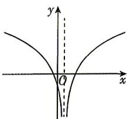
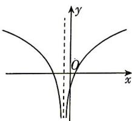
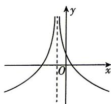
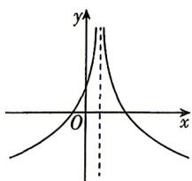

<!-- question-source:start -->
9.[河南郑州外国语学校2026高一月考]已知函数 $f(x)=a^{2x-1}-\frac{1}{2}(a>0$ 且 $a\neq1)$ 的图象过定点 $(m,n)$ ，则函数 $g(x)=\log_{n}|x-m|$ 的大致图象为()

A

C

B

D
<!-- question-source:end -->

![[Q00084030A1]]
