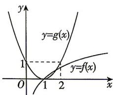

> [!faq]- 答案与解析
>
> > [!success]- **【答案】** B
>
> > [!note]- **【解析】**
> > B 【解析】若 $0 < a < 1$ ，此时 $x \in (1,2]$ ， $\log_a x < 0$ ，而 $(x-1)^2 \geqslant 0$ ，故 $(x-1)^2 < \log_a x$ 无解；若 $a > 1$ ，此时 $x \in (1,2]$ ， $\log_a x > 0$ ，而 $(x-1)^2 \geqslant 0$ ，令 $f(x) = \log_a x, g(x) = (x-1)^2$ ，在同一平面直角坐标系内画出两函数的大致图象如图所示，
> >
> > 
> >
> > 由图知,要使 $(x-1)^{2}<\log_{a}x$ 在 $x\in(1,2]$ 时恒成立,则需 $\log_{a}2>1$ ,
> > 解得 $a \in (1,2)$ .
> >
> > 故选 **B**.
