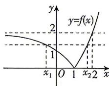

> [!faq]- 答案与解析
>
> > [!success]- **【答案】** A
>
> > [!note]- **【解析】**
> > A 【解析】作出函数 $f(x) = |2^x - 2|$ 的图象，如图所示，因为 $f(x_1) = f(x_2)$ ，即 $|2^{x_1} - 2| = |2^{x_2} - 2|$ ，因为 $x_1 < x_2$ ，所以由图可知， $x_1 < 1, 1 < x_2 < 2$ ，即 $2 - 2^{x_1} = 2^{x_2} - 2$ ，所以有 $2^{x_1} + 2^{x_2} = 4$ . 则 $2^{-x_1} + 2^{2 - x_2} = \frac{1}{2^{x_1}} + \frac{4}{2^{x_2}} = \frac{1}{4}\left(\frac{1}{2^{x_1}} + \frac{4}{2^{x_2}}\right) \cdot (2^{x_1} + 2^{x_2}) = \frac{1}{4}\left(5 + \frac{2^{x_2}}{2^{x_1}} + \frac{4 \times 2^{x_1}}{2^{x_2}}\right) \geqslant \frac{1}{4} \cdot \left(5 + 2\sqrt{\frac{2^{x_2}}{2^{x_1}} \cdot \frac{4 \times 2^{x_1}}{2^{x_2}}}\right) = \frac{9}{4}$ ，当且仅当 $\frac{2^{x_2}}{2^{x_1}} = \frac{4 \times 2^{x_1}}{2^{x_2}}$ ，即 $x_1 = \log_2\frac{4}{3}, x_2 = \log_2\frac{8}{3}$ 时等号成立，所以 $2^{-x_1} + 2^{2 - x_2}$ 的最小值为 $\frac{9}{4}$ . 故选 A.
> >
> > 
