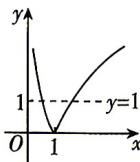

> [!faq]- 答案与解析
>
> > [!success]- **【答案】** C
>
> > [!note]- **【解析】**
> > C 【解析】先画出函数 $y = |\log_a x|$ 的大致图象, 再画出直线 $y = 1$ , 如图所示, 交
> >
> > 点为 $(a,1)$ 和 $\left(\frac{1}{a},1\right)$
> >
> > 
> >
> > 由于不等式 $|f(x)| > 1$ 对于任意 $x \in [2, +\infty)$ 恒成立，当 $a > 1$ 时，右边交点为 $(a, 1)$ ，则 $a < 2$ ，所以 $a \in (1, 2)$ ；当 $0 < a < 1$ 时，右边交点为 $\left(\frac{1}{a}, 1\right)$ ，则 $\frac{1}{a} < 2$ ，所以 $a \in \left(\frac{1}{2}, 1\right)$ 综上可知，实数 $a$ 的取值范围是 $\left(\frac{1}{2}, 1\right) \cup (1, 2)$ .
> >
> > 故选 **C**.
