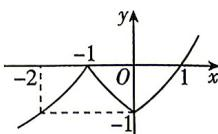

> [!faq]- 答案与解析
>
> > [!success]- **【答案】** -2
>
> > [!note]- **【解析】**
> > 当 $x \geqslant -1$ 时, 若 $-1 \leqslant x \leqslant 0$ , 则 $f(x) = \left(\frac{1}{2}\right) - 2$ 在 $[-1, 0]$ 上单调递减, $f(x) \in [-1, 0]$ ; 若 $x > 0$ , 则 $f(x) = 2^x - 2$ 在 $(0, +\infty)$ 上单调递增, $f(x) \in (-1, +\infty)$ ; 当 $x < -1$ 时, $f(x) = \log_{\frac{1}{2}}(-x) = -\log_2(-x)$ , 则 $f(x)$ 在 $(- \infty, -1)$ 上单调递增, $f(x) \in (-\infty, 0)$ , 作出函数 $f(x)$ 的大致图象如图所示.
> >
> > 
> >
> > “ $f(x) \geqslant a$ ”的充要条件是“ $x \geqslant b$ ”(b<0)，即若 $x \geqslant b$ ，则 $f(x) \geqslant a$ ；若 $f(x) \geqslant a$ ，则 $x \geqslant b$ ，即 $x = b$ 是 $f(x) \geqslant a$ 的最小解，且 $f(x)$ 在 $[b, +\infty)$ 上满足 $f(x) \geqslant a$ ，在
> >
> > $$
> > (- \infty , b)
> > $$
> >
> > $$
> > f (x) <   a.
> > $$
> >
> > $(-∞,b)$ 上满足 $f(x)<a$ .
> >
> > 为此，找到最大的负数 $b$ ，使得“ $x≥b$ ”是“ $f(x)≥a$ ”的充要条件的核心是找到 $f(x)≥a$ 在 $x<0$ 时的临界点.
> >
> > 根据以上分析知， $b∈(-∞,-1)$ ,
> >
> > → 点悟： $b$ 的值必在 $f(x)$ 的单调递增区间 $(-∞,-1)$ 内
> >
> > 因为 $f(-2)=\log_{\frac{1}{2}}2=-1=f(0)$ ，由图知，当 $x<-2$ 时， $f(x)<-1$ ；当 $-2≤x<-1$ 时， $f(x)≥-1$ ；当 $-1≤x<0$ 时， $f(x)≥-1$ ；当 $x≥0$ 时， $f(x)≥-1$ 。
> >
> > 因此“ $f(x)≥-1$ ”的充要条件是“ $x≥-2$ ”，结合条件 $b<0$ ，可知 $b$ 的最大值为 -2。
