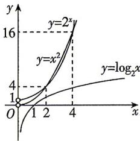

> [!faq]- 答案与解析
>
> > [!success]- **【答案】** D
>
> > [!note]- **【解析】**
> > D 【解析】由 $9^{x}+1>1$ 恒成立，得 $f(x)$ 的定义域为 R，关于原点对称， $f(x)=\log_{3}(9^{x}+1)-x=\log_{3}(9^{x}+1)-\log_{3}3^{x}=$ $\log_{3}\frac{9^{x}+1}{3^{x}}=\log_{3}(3^{x}+3^{-x})$ 由 $f(-x)=\log_{3}(3^{-x}+3^{x})=f(x)$ ，得 $f(x)$ 为偶函数，则 $c=f(\log_{\frac{1}{2}}\sqrt{2})=f\left(-\frac{1}{2}\right)=f\left(\frac{1}{2}\right)$ 又 $1=\log_{3}3>\log_{3}2>\log_{3}\sqrt{3}=\frac{1}{2},1=\log_{5}5>$ $\log_{5}3>\log_{5}\sqrt{5}=\frac{1}{2},\log_{3}2=\frac{1}{3}\log_{3}2^{3}=$ $\frac{1}{3}\log_{3}8<\frac{1}{3}\log_{3}9=\frac{2}{3},\log_{5}3=\frac{1}{3}\log_{5}3^{3}=$ $\frac{1}{3}\log_{5}27>\frac{1}{3}\log_{5}25=\frac{2}{3}$ 故 $\frac{1}{2}<\log_{3}2<\log_{5}3<1.$ 当 $x \in (0,1]$ 时， $3^{x} \in (1,3]$ ，且 $y = 3^{x}$ 在 (0,1) 上单调递增，令 $t = 3^{x} \in (1,3]$ ，
> > 令 $y=t+\frac{1}{t}, t\in(1,3]$ ，由对勾函数性质可得该函数在(1,3]上单调递增，
> > 而函数 $y=\log_{3}x$ 在定义域内单调递增，
> >
> > 在同一平面直角坐标系内作出函数 $y = \log_2x, y = x^2, y = 2^x$ 的简图如图所示，
> >
> > 
> >
> > ## 第4.3,4.4节综合训练
> >
> > 所以 $f(x) = \log_3(3^x + 3^{-x})$ 在 $(0,1]$ 上单调递增，则 $f(\log_{\frac{1}{2}}\sqrt{2}) < f(\log_32) < f(\log_53)$ ，即 $c < a < b$ 。
> >
> > 故选 **D**.
