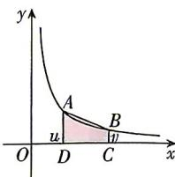

> [!faq]- 答案与解析
>
> > [!success]- **【答案】** ABC
>
> > [!note]- **【解析】**
> > ABC 【解析】由题意 $L(1,x)=-L(x,1)=\ln x$ ，所以 $L(x,1)=-\ln x$ ，
> > 当 u>1 时， $L(u,v)=L(1,v)-L(1,u)=\ln v-\ln u;$ 当 v<1 时， $L(u,v)=L(u,1)-L(v,1)=\ln v-\ln u;$ 当 u<1<v 时， $L(u,v)=L(u,1)+L(1,v)=\ln v-\ln u;$ 当 v=1 或 u=1 时， $L(u,v)=\ln v-\ln u$ 也成立.
> > 综上所述， $L(u,v)=\ln v-\ln u.$ 对于选项 A: $L\left(\frac{1}{6},\frac{1}{3}\right)=\ln\frac{1}{3}-\ln\frac{1}{6}=$ $\ln 2, L(4,8)=\ln 8-\ln 4=\ln 2,$ 所以 $L\left(\frac{1}{6},\frac{1}{3}\right)=L(4,8)$ ，故 A 正确；
> > 对于选项 B: $L(4^{50},3^{100})=\ln3^{100}-\ln4^{50}=\ln3^{100}-\ln2^{100}=100(\ln3-\ln2)$ ,
> > 且 $L(2,3)=\ln3-\ln2$ ，所以 $L(4^{50},3^{100})=100L(2,3)$ ，故 B 正确；
> > 对于选项 C：如图，
> >
> > 
> >
> > 因为 $S_{\text{阴影}} < S_{\text{梯形}ABCD}$ , 所以 $L(u,v) = \ln v - \ln u < \frac{1}{2}(v - u)\left(\frac{1}{v} + \frac{1}{u}\right) = \frac{1}{2} \cdot \frac{v^2 - u^2}{uv} =$
> >
> > $$
> > \frac {1}{2} \left(\frac {v}{u} - \frac {u}{v}\right)
> > $$
> >
> > $\rightarrow$ 黑板：数形结合，通过面积来比较大小即 $2L(u,v) < \frac{v}{u} - \frac{u}{v}$ ，故C正确；对于选项D：取 $u = 1, v = 2$ ，则 $L(u^u, v^u) = L(1, 2) = \ln 2 < 2 - 1 = 1$ ，故D错误.
> >
> > 故选 **ABC**.
