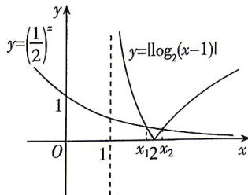

> [!faq]- 答案与解析
>
> > [!success]- **【答案】** B
>
> > [!note]- **【解析】**
> > B 【解析】令 $f(x)=0$ ，则 $\left(\frac{1}{2}\right)^{x}=|\log_{2}(x-1)|$ ，在同一平面直角坐标系中作出函数 $y=\left(\frac{1}{2}\right)^{x}$ 与 $y=|\log_{2}(x-1)|$ 的图象如图所示.
> >
> > [218]
> >
> > 
> >
> > 不妨设 $x_{1} < x_{2}$ ，则由图象可得 $1 < x_{1} < 2 < x_{2}$ ， $\therefore (x_{1} - 2)(x_{2} - 2) < 0$ ，故D错误。 $\log_2[(x_1 - 1)(x_2 - 1)] = \log_2(x_1 - 1) + \log_2(x_2 - 1) = -\left(\frac{1}{2}\right)^{x_1} + \left(\frac{1}{2}\right)^{x_2} < 0,$ $\therefore 0 < (x_{1} - 1)(x_{2} - 1) < 1$ ，故C错误。 $\cdot \left(\frac{1}{2}\right)^{\frac{3}{2}} < 1 = \left|\log_2\left(\frac{3}{2} - 1\right)\right|, \ldots, \frac{3}{2} < x_1 < 2$ ，即 $\frac{1}{2} < x_{1} - 1 < 1$ ，又 $x_{2} - 1 > 1$ ，结合C选项可得 $\frac{1}{2} < (x_{1} - 1) < (x_{2} - 1) < 1$ ，故A错误，B正确。
> >
> > 故选 **B**.
