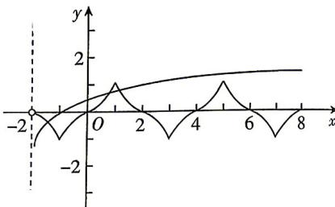
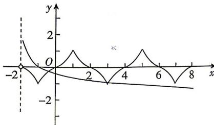

> [!faq]- 答案与解析
>
> > [!success]- **【答案】** D
>
> > [!note]- **【解析】**
> > D 【解析】因为函数 $f(x)$ 是定义在 R 上的奇函数, 当 $x \in [0,1]$ 时, $f(x) = 2^x - 1$ , 所以当 $x \in [-1,0]$ 时, $f(x) = -f(-x) = -2^{-x} + 1$ . 又对任意的 $x \in \mathbb{R}$ , 都有 $f(1 - x) = f(1 + x)$ , 欧黑板: 若 $f(a - x) = f(a + x)$ , 则 $f(x)$ 的图象关于直线 $x = a$ 对称所以 $f(x)$ 的图象关于直线 $x = 1$ 对称, $f(1 + (3 + x)) = f(1 - (3 + x)) = f(-2 - x) =$ $-f(2+x)$ ，即 $f(4+x)=-f(2+x)$ .
> > 又 $f(1+(1+x))=f(1-(1+x))=f(-x)=-f(x)$ ，即 $f(2+x)=-f(x)$ ，
> > 所以 $f(4+x)=-f(2+x)=-[-f(x)]=f(x)$ ，所以函数 $f(x)$ 是以4为周期的函数.
> > 由方程 $f(x)=\log_{a}(x+2)(a>0$ 且 $a\neq1)$ 恰有3个不同的实数根，
> > 得函数 $f(x)$ 的图象与 $y=\log_{a}(x+2)(a>0$ 且 $a\neq1)$ 的图象有3个不同的交点， $f(1)=1=f(5)=1,f(-1)=f(3)=f(7)=-1.$ 当a>1时，画出函数 $y=f(x)$ 与 $y=\log_{a}(x-2)$ 的部分图象如图所示，
> >
> > 
> >
> > 由图可知,要使两函数图象有3个交点
> > 则 $\left\{\begin{aligned}\log_{a}(1+2)<1,\\ \log_{a}(5+2)>1,\end{aligned}\right.$ 解得3<a<7;
> > 当0<a<1时，画出函数 $y=f(x)$ 与 $y-\log_{a}(x+2)$ 的部分图象如图所示，
> >
> > 
> >
> > 由图可知,要使两函数图象有3个交点
> > 则 $\left\{\begin{aligned}\log_{a}(3+2)>-1,\\ \log_{a}(7+2)<-1,\end{aligned}\right.$ 解得 $\frac{1}{9}<a<\frac{1}{5}.$ 综上，实数 a 的取值范围是 $\left(\frac{1}{9},\frac{1}{5}\right)\cup(3,7)$ .
> >
> > 故选 **D**.
