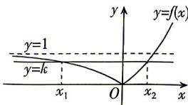

> [!faq]- 答案与解析
>
> > [!success]- **【答案】** BCD
>
> > [!note]- **【解析】**
> > BCD 【解析】函数 $f(x)$ 的定义域为 R. $f(-x)=|a^{-x}-1|=\left|\left(\frac{1}{a}\right)-1\right|$ 与 $f(x)=|a^{x}-1|$ 不恒相等，故 $f(x)$ 不是偶函数，故 A 错误. $f(0)=|a^{0}-1|=0$ ，所以 $f(x)$ 的图象经过原点，故 B 正确. 令 $g(x)=0$ ，即 $f(x)=2$ ，即 $|a^{x}-1|=2$ ，所以 $a^{x}-1=-2$ 或 $a^{x}-1=2$ 。当 $a^{x}-1=-2$ 时， $a^{x}=-1$ ，因为 $a^{x}>0$ ，所以无解；当 $a^{x}-1=2$ 时，解得 $x=\log_{a}3$ ，所以函数 $g(x)=f(x)-2$ 只有一个零点，故 C 正确. $f(x)=|a^{x}-1|$ ，且 a>1，画出 $f(x)$ 的图象如图所示：
> >
> > 
> >
> > 设 $f(x_{1}) = f(x_{2}) = k$ ，则 $k\in (0,1)$ ，不妨设 $x_{1} <   x_{2}$ ，令 $f(x) = |a^x -1| = k$ ，解得 $x_{1} =$ $\log_a(1 - k),x_2 = \log_a(1 + k)$ ，所以 $x_{1} + x_{2} =$ $\log_{a}(1-k)+\log_{a}(1+k)=\log_{a}(1-k^{2}).$ 因为 $k \in (0,1)$ ，所以 $1-k^{2} \in (0,1)$ ，又因为 a > 1，所以 $\log_{a}(1-k^{2}) < 0$ ，即 $x_{1} + x_{2} < 0$ ，故 D 正确.
> >
> > 故选 **BCD**.
