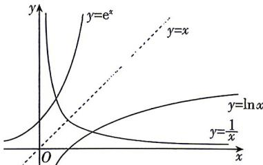

> [!faq]- 答案与解析
>
> > [!success]- **【答案】** AC
>
> > [!note]- **【解析】**
> > AC 【解析】由题意得 $f(x_{1})=x_{1}\ln x_{1}-1=0$ ，即 $\ln x_{1}=\frac{1}{x_{1}}$ . $g(x_{2})=\mathrm{e}^{x_{2}}(x_{2}-1)-\mathrm{e}=0$ ，易知 $x_{2}\neq1$ ，则 $e^{x_{2}-1}=\frac{1}{x_{2}-1}$ 令 $t=x_{2}-1$ ，则 $e^{t}=\frac{1}{t}$ 又因为 $y=\ln x, y=e^{x}$ 的图象关于直线 y=x 对称， $y=\frac{1}{x}$ 的图象关于直线 y=x 对称，
> >
> > 所以 $y=\ln x, y=e^{x}$ 的图象与 $y=\frac{1}{x}$ 图象的交点关于直线 y=x 对称，
> >
> > 所以 $x_{1}t=1$ ，即 $x_{1}(x_{2}-1)=1$ 因为 $f(1)=-1<0, f(2)=2\ln 2-1=\ln 4-\ln e>0$ ，且 $f(x)$ 在 $(1,2)$ 上单调，
> >
> > 所以由函数零点存在定理可知 $x_{1}\in(1,2)$ ，
> >
> > 又 $x_{1}(x_{2}-1)=1$ ，即 $x_{2}=\frac{1}{x_{1}}+1$ ，所以 $x_{2}\in\left(\frac{3}{2},2\right)$
> >
> > 
> >
> > 对于 A: $e^{x_{2}} \cdot \ln x_{1} = \frac{e}{x_{2}-1} \cdot \frac{1}{x_{1}} = \frac{e}{x_{1}(x_{2}-1)} = e, A$ 正确；
> > 对于 B: $\ln x_{1}-x_{2}=\frac{1}{x_{1}}-x_{2}=(x_{2}-1)-x_{2}=-1, B$ 错误；
> > 对于 C: 因为 $x_{1}(x_{2}-1)=1$ ，所以 $\frac{1}{x_{1}}=x_{2}-1$ ，
> > 因为 $x_{2}\in\left(\frac{3}{2},2\right)$ ，所以 $x_{2}-1\in\left(\frac{1}{2},1\right)$ ，
> > 所以 $e^{x_{2}-1}+\frac{1}{x_{1}}=\frac{1}{x_{2}-1}+(x_{2}-1)\geqslant2\sqrt{\frac{1}{x_{2}-1}\cdot(x_{2}-1)}=2,$ 当且仅当 $\frac{1}{x_{2}-1}=x_{2}-1$ ，即 $x_{2}=2$ 时等号成立，又 $x_{2}\in\left(\frac{3}{2},2\right)^{1}$ ，所以等号不成立，所以 $e^{x_{2}-1}+\frac{1}{x_{1}}>2,C$ 正确；
> > 对于 D: 因为 $x_{2}=\frac{1}{x_{1}}+1\in\left(\frac{3}{2},2\right)$ ，所以 $x_{2}+\frac{1}{1+\ln x_{1}}=\left(\frac{1}{x_{1}}+1\right)+\frac{1}{1+\frac{1}{x_{1}}}\geqslant$ $2\sqrt{\left(\frac{1}{x_{1}}+1\right)\cdot\frac{1}{1+\frac{1}{x_{1}}}}=2,$
> >
> > 当且仅当 $\frac{1}{x_1} + 1 = \frac{1}{1 + \frac{1}{x_1}}$ 时等号成立，又等号取不到，所以 $x_2 + \frac{1}{1 + \ln x_1} > 2, \mathrm{D}$ 错误.
> >
> > 故选 **AC**.
