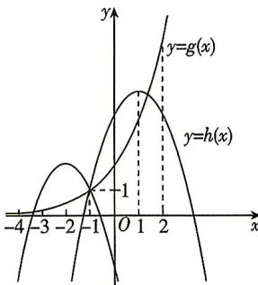

> [!faq]- 答案与解析
>
> > [!success]- **【答案】** A
>
> > [!note]- **【解析】**
> > $\left[-\frac{113}{24}, \frac{29}{8}\right) \cup \left(\frac{3}{2}, \frac{10}{3}\right]$ 【解析】设 $g(x) = 2^{x + 1}, h(x) = -x^2 + ax + a + 2$ ，因为 $g(-1) = 2^0 = 1, h(-1) = -1 - a + a + 2 = 1$ ，所以函数 $g(x), h(x)$ 的图象均过点 $(-1, 1)$ . 作出函数 $g(x), h(x)$ 的大致图象如图所示.
> >
> > 
> >
> > 当 $\frac{a}{2}>-1$ ，即a>-2时，由 $g(x)<h(x)$ 恰有两个整数解，可得这两个整数解为0,1，
> > 所以 $\left\{\begin{aligned}h(1)>g(1),\\h(2)\leqslant g(2)\end{aligned}\right.$ ，即 $\left\{\begin{aligned}2a+1>2^{2},\\3a-2\leqslant2^{3}\end{aligned}\right.$ ，解得
> > →出坑：注意“端点值”的取舍 $\frac{3}{2}<a\leqslant\frac{10}{3};$ 当 $\frac{a}{2}<-1$ ，即a<-2时，由 $g(x)<h(x)$ 恰有两个整数解，可得这两个整数解为-2,-3，
> > 所以 $\left\{\begin{aligned}h(-3)>g(-3),\\h(-4)\leqslant g(-4)\end{aligned}\right.$ ，即 $\left\{\begin{aligned}-2a-7>2^{-2},\\-3a-14\leqslant2^{-3}\end{aligned}\right.$ 解得 $-\frac{113}{24}\leqslant a<-\frac{29}{8};$ 当 $\frac{a}{2}=-1$ ，即a=-2时， $g(x)<h(x)$ 不可能有两个整数解.
> > 综上,实数a的取值范围是 $\left[-\frac{113}{24},-\frac{29}{8}\right)\cup$
> >
> > $$
> > \left(\frac {3}{2}, \frac {1 0}{3} \right]
> > $$
