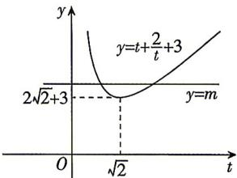

> [!faq]- 答案与解析
>
> > [!success]- **【答案】** D
>
> > [!note]- **【解析】**
> > D 【解析】由题意得 $\left\{\begin{aligned}x-1&\geqslant0,\\ \log_{\sqrt{3}}x&-2\neq0,\\ x&>0,\end{aligned}\right.$ $\left\{\begin{aligned}x&\geqslant1,\\ \log_{\sqrt{3}}x&\neq2,\\ x&>0,\end{aligned}\right.$ 解得 $x\geqslant1$ 且 $x\neq3,$ 则函数 $y=\frac{\sqrt{x-1}}{\log_{\sqrt{3}}x-2}$ 的定义域为 $[1,3)\cup(3,+\infty)$ . 故选 D.
> >
> > [220]
> >
> > 所以方程 $m = \frac{1}{f(x) + f(1 - x)}$ ，即 $m =$ 敲黑板：含参函数零点问题，可运用参数分离法转化为两函数图象的交点问题 $\frac{(t + 1)(t + 2)}{t} = t + \frac{2}{t} + 3$ 有两个不同的正根，即函数 $y = t + \frac{2}{t} + 3$ 的图象与直线 $y = m$ 在 $(0, +\infty)$ 上有两个不同的交点，而由对勾函数 $y = t + \frac{2}{t} + 3 \geqslant 2\sqrt{2} + 3$ ，当且仅当 $t = \frac{2}{t}$ ，即 $t = \sqrt{2}$ 时等号成立，且函数 $y = t + \frac{2}{t} + 3$ 在 $(0, \sqrt{2})$ 上单调递减，在 $[\sqrt{2}, +\infty)$ 上单调递增，当 $x \to 0$ 时， $y \to +\infty$ ；当 $x \to +\infty$ 时， $y \to +\infty$ ，画出函数 $y = t + \frac{2}{t} + 3$ 在 $(0, +\infty)$ 上的大致图象如图所示，
> >
> > 
> >
> > 结合图象可得 $m>2\sqrt{2}+3$ ，故实数 m 的取值范围为 $(2\sqrt{2}+3,+\infty)$ .
