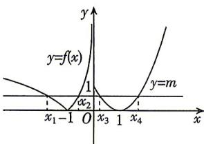

> [!faq]- 答案与解析
>
> > [!success]- **【答案】** ABD
>
> > [!note]- **【解析】**
> > ABD
> > 思路导引 尝试画出 $f(x)$ 的简图,根据 $f(x)$ 的图象与直线 y=m 有四个交点,得到 m 的取值范围,又 $x_{1}<x_{2}<x_{3}<x_{4}$ ,则 $-\ln(-x_{2})=\ln(-x_{1})$ ,结合对数运算,可以得到 $x_{1},x_{2}$ 之间的关系;再来研究 $x_{3},x_{4}$ 之间的关系, $x_{3},x_{4}$ 关于二次函数图象的对称轴直线 x=1 对称,则 $x_{3}+x_{4}=2$ . 最后根据以上结论,逐项对选项进行分析即可.
> > 【解析】画出函数 $f(x)$ 的大致图象如图所示.
> >
> > 
> >
> > 由图象可知， $0 < m \leqslant 1$ 由题意可知， $f(x_{1}) = \ln (-x_{1}) = m$ $f(x_{2}) = -\ln (-x_{2}) = m,$ 则 $\ln (-x_1) + \ln (-x_2) = \ln (x_1x_2) = 0$ ，所以 $x_{1}x_{2} = 1$ ，故A正确；
> > 又 $x_{3},x_{4}$ 是方程 $x^{2} - 2x + 1 = m$ 的两根，则 $x_{3} + x_{4} = 2,x_{3}x_{4} = 1 - m\in [0,1),$ 巧思：直线 $y = m$ 与 $y = f(x)$ 的图象在 $(0, + \infty)$ 上的两个交点关于直线 $x = 1$ 对称，所以 $x_{3} + x_{4} = 2$ 故 $x_{3}x_{4}$ 无最大值，故B正确，C错误；
> > 由 $0 < m\leqslant 1$ ，即 $0 < \ln (-x_{1})\leqslant 1$ ，得 $-\mathrm{e}\leqslant$ $x_{1} < -1$ ，又 $x_{1} + x_{2} + x_{3} + x_{4} = x_{1} + \frac{1}{x_{1}} +2,$ 令 $g(x) = x + \frac{1}{x} +2$ ，结合对勾函数的性质可知 $g(x)$ 在[-e，-1）上单调递增，又 $g(-1) = 0,g(-\mathrm{e}) = -\frac{1}{\mathrm{e}} -\mathrm{e} + 2,$ 所以 $g(x_{1})\in \left[-\frac{1}{\mathrm{e}} -\mathrm{e} + 2,0\right)$ ，所以 $x_{1} + x_{2} + x_{3}+$ $x_{4}\in \left[-\frac{1}{\mathrm{e}} -\mathrm{e} + 2,0\right)$ ，故D正确.
> >
> > 故选 **ABD**.
