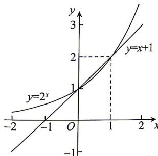

> [!faq]- 答案与解析
>
> > [!success]- **【答案】** D
>
> > [!note]- **【解析】**
> > D 【解析】因为 $f(x)=2^{x}-x-1$ ，所以 $f(x)>0$ 等价于 $2^{x}>x+1$ ，在同一直角坐标系中作出 $y=2^{x}$ 和 $y=x+1$ 的图象如图.
> >
> > 
> >
> > 两函数图象的交点坐标分别为(0,1)，(1,2)，则不等式 $2^{x}>x+1$ 的解为x<0或x>1，所以不等式 $f(x)>0$ 的解集为 $(-∞,0)∪(1,+∞)$ .
> >
> > 故选 **D**.
