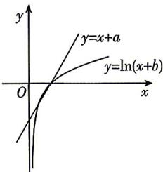

> [!faq]- 答案与解析
>
> > [!success]- **【答案】** C
>
> > [!note]- **【解析】**
> > C 【解析】 $f(x)=(x+a)\ln(x+b)\geqslant0$ 可看作 $f_{1}(x)=x+a$ 与 $f_{2}(x)=\ln(x+b)$ 在定义域 $(-b,+\infty)$ 内同正同负，因此两函数图象与 x 轴的交点重合，如图所示.
> > → 点悟：将 $f(x)=(x+a)\ln(x+b)\geqslant0$ 看成直线与曲线的相交问题，判断出在 x 轴上的交点重合
> >
> > 
> >
> > 令 $f_{1}(x) = x + a = 0, f_{2}(x) = \ln (x + b) = 0$ ，得 $-a = 1 - b$ ，即 $a - b + 1 = 0, a^2 + b^2 = (b - 1)^2 + b^2 = 2b^2 - 2b + 1 = 2\left(b - \frac{1}{2}\right)^2 + \frac{1}{2} \geqslant \frac{1}{2}$ ，所以 $a^2 + b^2$ 的最小值为 $\frac{1}{2}$ ，
> >
> > 故选 **C**.
