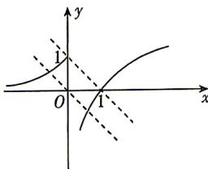

> [!faq]- 答案与解析
>
> > [!success]- **【答案】** C
>
> > [!note]- **【解析】**
> > C 【解析】∵ 函数 $g(x)$ 存在 2 个零点，∴ 函数 $y=f(x)$ 的图象与 y=-x-a 的图象有 2 个交点.
> > 如图, 平移直线 y = -x , 可以看出当且仅当 $-a \leqslant 1$ , 即 $a \geqslant -1$ 时, 直线 $y = -x - a$ 与 $y = f(x)$ 的图象有 2 个交点. 故选 C.
> > → 点悟：通过直线的平移判断交点个数, 进而得到 a 的取值范围
> >
> > 
