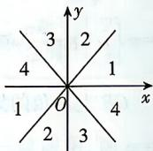

> [!faq]- 答案与解析
>
> > [!success]- **【答案】** BD
>
> > [!note]- **【解析】**
> > BD 【解析】因为 $\alpha$ 是第二象限角, 所以 $90^{\circ} + k \cdot 360^{\circ} < \alpha < 180^{\circ} + k \cdot 360^{\circ}, k \in Z$ .
> >
> > 对于 A, 由已知可得 $-180^{\circ} - k \cdot 360^{\circ} < -\alpha < -90^{\circ} - k \cdot 360^{\circ}, k \in Z$ , 即 $-\alpha$ 是第三象限角, 所以 A 错误.
> >
> > 对于 B, 由已知可得 $45^{\circ} + k \cdot 180^{\circ} < \frac{\alpha}{2} < 90^{\circ} + k \cdot 180^{\circ}, k \in Z$ , 当 k 为偶数时, $\frac{\alpha}{2}$ 是第一象限角; 当 k 为奇数时, $\frac{\alpha}{2}$ 是第三象限角, 所以 B 正确.
> >
> > 对于 C, 由已知可得 $360^{\circ} + k \cdot 360^{\circ} < 270^{\circ} + \alpha < 450^{\circ} + k \cdot 360^{\circ}, k \in Z$ , 即 $(k + 1) \cdot 360^{\circ} < 270^{\circ} + \alpha < 90^{\circ} + (k + 1) \cdot 360^{\circ}, k \in Z$ , 即 $270^{\circ} + \alpha$ 是第一象限角, 所以 C 错误.
> >
> > 对于 D, 由已知可得 $180^{\circ} + 2k \cdot 360^{\circ} < 2\alpha < 360^{\circ} + 2k \cdot 360^{\circ}, k \in Z$ , 所以角 $2\alpha$ 的终边位于第三象限或第四象限或 y 轴负半轴上, 所以 D 正确. 故选 BD.
> >
> > 特别注意 D 选项中, $180^{\circ} + 2k \cdot 360^{\circ} < 2\alpha < 360^{\circ} + 2k \cdot 360^{\circ} (k \in Z)$ 的范围包含终边在 y 轴的负半轴上这一轴线角, 而轴线角不属于任何象限, 必须单独说明.
> >
> > 多种解法 对 B 选项, 求角 $\frac{\alpha}{2}$ 的终边所在象限, 将每个象限平均分成 2 份, 从 x 轴正半轴开始按逆时针方向依次标上 1, 2, 3, 4, 标满为止. 因为角 $\alpha$ 是第二象
> >
> > 限角,所以角 $\frac{\alpha}{2}$ 在数字2所在区域内,对应图形可得角 $\frac{\alpha}{2}$ 的终边在第一象限和第三象限内,
> >
> > 
> >
> > 规律方法 已知角 $\alpha$ 所在的象限, 确定角 $\frac{\alpha}{n} (n \in \mathbf{N}^*)$ 所在象限的常用方法
> > (1) 分类讨论法: 先根据角 $\alpha$ 的范围用整数 $k$ 把角 $\frac{\alpha}{n} (n \in \mathbf{N}^*)$ 的范围表示出来, 再对 $k$ 分几种情况讨论.
> > (2) 几何法: 把各象限平均 $n$ 等分, 再从 $x$ 轴正半轴开始按逆时针依次将各区域标上 1, 2, 3, 4, 标满为止, 则角 $\alpha$ 原来是第几象限角, 对应的标号所在的区域即为角 $\frac{\alpha}{n} (n \in \mathbf{N}^*)$ 的终边所在的区域.
> >
> > ☑ 易错
> > ★ 易错点 应用终边相同的角的公式时不能分类讨论或合并化简而致误
