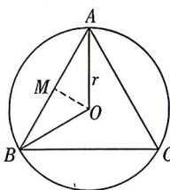

> [!faq]- 答案与解析
>
> > [!success]- **【答案】** D
>
> > [!note]- **【解析】**
> > D 【解析】如图,等边三角形 ABC 是半径为 r 的圆 O 的内接三角形,
> >
> > 
> >
> > 则线段 $AB$ 所对的圆心角 $\angle AOB = \frac{2\pi}{3}$ 作 $OM \perp AB$ ，垂足为 $M$ ，
> > 在 Rt△AOM 中， $AO = r, \angle AOM = \frac{\pi}{3}$ 所以 $AM = \frac{\sqrt{3}}{2} r, AB = \sqrt{3} r.$ 故圆弧长度 $l = \sqrt{3} r$ 所以长度等于圆内接正三角形的边长的圆弧所对圆心角的弧度数为 $\alpha = \frac{l}{r} = \sqrt{3}$
> >
> > 故选 **D**.
