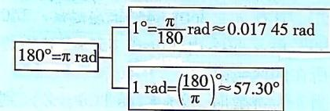

> [!faq]- 答案与解析
>
> > [!success]- **【答案】** D
>
> > [!note]- **【解析】**
> > D 【解析】 $390^{\circ}=390\times\frac{\pi}{180}=\frac{13}{6}\pi.$ 故选 D.
> > 名师点拨 $180^{\circ}=\pi rad$ $1^{\circ}=\frac{\pi}{180}rad\approx0.01745rad$ $1\mathrm{rad}=\left(\frac{180}{\pi}\right)^{\circ}\approx57.30^{\circ}$
> >
> > 
