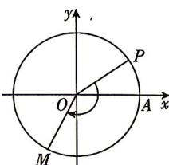

> [!faq]- 答案与解析
>
> > [!success]- **【答案】** B
>
> > [!note]- **【解析】**
> > B【解析】设单位圆与 $x$ 轴正半轴的交点为 $A$
> >
> > 
> >
> > 因为 $P\left(\frac{\sqrt{3}}{2}, \frac{1}{2}\right)$ , 所以 $\sin \angle AOP = \frac{1}{2}$ , 由于 $P\left(\frac{\sqrt{3}}{2}, \frac{1}{2}\right)$ 在第一象限, 不妨取 $\angle AOP = \frac{\pi}{6}$ , 因为按顺时针方向做匀速圆周运动, 角速度为 $\frac{\pi}{6} \mathrm{rad/s}, 5 \mathrm{s}$ 时质点到达点 $M$ , 所以质点转过了 $-\frac{\pi}{6} \times 5 = -\frac{5\pi}{6}$ ,
