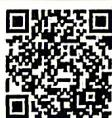

## 5.4.1 正弦函数、余弦函数的图象

视频讲解
拍照批改

## 刷基础

题型1 画图

![[高中/课堂同步/教辅/必刷题/2027版 高中必刷题数学必修第一册RJA/05_第五章_三角函数/5_4_1_正弦函数_余弦函数的图象/questions/Q00085197.md]]
![[高中/课堂同步/教辅/必刷题/2027版 高中必刷题数学必修第一册RJA/05_第五章_三角函数/5_4_1_正弦函数_余弦函数的图象/questions/Q00085198.md]]
![[高中/课堂同步/教辅/必刷题/2027版 高中必刷题数学必修第一册RJA/05_第五章_三角函数/5_4_1_正弦函数_余弦函数的图象/questions/Q00085199.md]]
![[高中/课堂同步/教辅/必刷题/2027版 高中必刷题数学必修第一册RJA/05_第五章_三角函数/5_4_1_正弦函数_余弦函数的图象/questions/Q00085200.md]]
![[高中/课堂同步/教辅/必刷题/2027版 高中必刷题数学必修第一册RJA/05_第五章_三角函数/5_4_1_正弦函数_余弦函数的图象/questions/Q00085201.md]]
![[高中/课堂同步/教辅/必刷题/2027版 高中必刷题数学必修第一册RJA/05_第五章_三角函数/5_4_1_正弦函数_余弦函数的图象/questions/Q00085202.md]]
![[高中/课堂同步/教辅/必刷题/2027版 高中必刷题数学必修第一册RJA/05_第五章_三角函数/5_4_1_正弦函数_余弦函数的图象/questions/Q00085203.md]]
![[高中/课堂同步/教辅/必刷题/2027版 高中必刷题数学必修第一册RJA/05_第五章_三角函数/5_4_1_正弦函数_余弦函数的图象/questions/Q00085204.md]]
![[高中/课堂同步/教辅/必刷题/2027版 高中必刷题数学必修第一册RJA/05_第五章_三角函数/5_4_1_正弦函数_余弦函数的图象/questions/Q00085205.md]]
![[高中/课堂同步/教辅/必刷题/2027版 高中必刷题数学必修第一册RJA/05_第五章_三角函数/5_4_1_正弦函数_余弦函数的图象/questions/Q00085206.md]]
![[高中/课堂同步/教辅/必刷题/2027版 高中必刷题数学必修第一册RJA/05_第五章_三角函数/5_4_1_正弦函数_余弦函数的图象/questions/Q00085207.md]]
![[高中/课堂同步/教辅/必刷题/2027版 高中必刷题数学必修第一册RJA/05_第五章_三角函数/5_4_1_正弦函数_余弦函数的图象/questions/Q00085208.md]]
![[高中/课堂同步/教辅/必刷题/2027版 高中必刷题数学必修第一册RJA/05_第五章_三角函数/5_4_1_正弦函数_余弦函数的图象/questions/Q00085209.md]]
![[高中/课堂同步/教辅/必刷题/2027版 高中必刷题数学必修第一册RJA/05_第五章_三角函数/5_4_1_正弦函数_余弦函数的图象/questions/Q00085210.md]]
![[高中/课堂同步/教辅/必刷题/2027版 高中必刷题数学必修第一册RJA/05_第五章_三角函数/5_4_1_正弦函数_余弦函数的图象/questions/Q00085211.md]]
![[高中/课堂同步/教辅/必刷题/2027版 高中必刷题数学必修第一册RJA/05_第五章_三角函数/5_4_1_正弦函数_余弦函数的图象/questions/Q00085212.md]]
![[高中/课堂同步/教辅/必刷题/2027版 高中必刷题数学必修第一册RJA/05_第五章_三角函数/5_4_1_正弦函数_余弦函数的图象/questions/Q00085213.md]]
