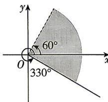

<!-- question-source:start -->
6.[河南省实验中学2026高一期末]如图,终边落在阴影部分的角 $\alpha$ 的集合是()

. [河南省实验中学 2026 高一期落在阴影部分的角 $\alpha$ 的集合是
A. $\{\alpha| - 30^{\circ} \leqslant \alpha < 60^{\circ}\}$ B. $\{\alpha| - 30^{\circ} + k \cdot 180^{\circ} \leqslant \alpha < 60^{\circ} + k \cdot 180^{\circ}, k \in \mathbf{Z}\}$ C. $\{\alpha | 60^{\circ} + k \cdot 360^{\circ} \leqslant \alpha < 330^{\circ} + k \cdot 360^{\circ}, k \in \mathbf{Z}\}$

D. $\{\alpha | - 30^{\circ} + k\cdot 360^{\circ}\leqslant \alpha <  60^{\circ} + k\cdot 360^{\circ},k\in \mathbf{Z}\}$

## 题型3 象限角与轴线角的判断
<!-- question-source:end -->

![[Q00084163A1]]
