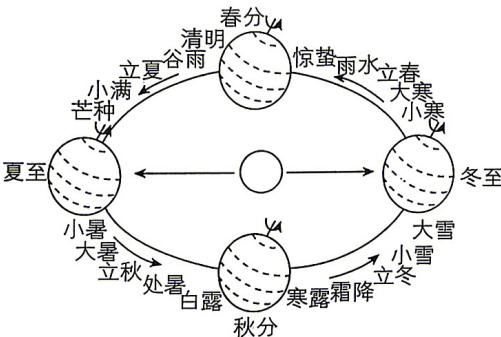

<!-- question-source:start -->
2. 现行的二十四节气是根据地球在黄道(即地球绕太阳公转的轨道)上的位置变化而制定的, 每个节气对应地球在黄道上运动 $15^{\circ}$ 所到达的一个位置. 根据描述, 从立冬到立春对应地球在黄道上运动所对圆心角的弧度数为 ( )

<!-- question-source:end -->

![[Q00084168A1]]
