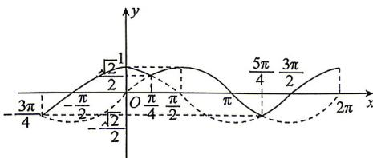

> [!faq]- 答案与解析
>
> > [!success]- **【答案】** ABC
>
> > [!note]- **【解析】**
> > ABC 【解析】画出函数 $f(x)$ 的部分图象
> > → 点悟：画 $f(x)$ 的图象，
> > 在 $\sin x \geqslant \cos x$ 的范围内画 $y = \sin x$ 的图象；
> > 在 $\sin x < \cos x$ 的范围内画 $y = \cos x$ 的图象
> > 如图中实线所示，由图象可看出，该函数的值域是 $\left[-\frac{\sqrt{2}}{2},1\right]$ ；当且仅当 $x=2k\pi+\frac{\pi}{2}$ 或 $x=2k\pi,k\in\mathbf{Z}$ 时，函数 $f(x)$ 取得最大值1；当且仅当 $x=2k\pi+\frac{5\pi}{4},k\in\mathbf{Z}$ 时，函数 $f(x)$ 取得最小值 $-\frac{\sqrt{2}}{2}$ ；当且仅当 $2k\pi+\pi<x<2k\pi+\frac{3\pi}{2},k\in\mathbf{Z}$ 时， $f(x)<0$ 。故A,B,C不正确，D正确。
> >
> > 
