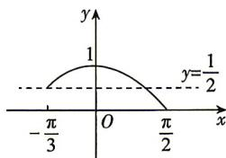

> [!faq]- 答案与解析
>
> > [!success]- **【答案】** C
>
> > [!note]- **【解析】**
> > C 【解析】由 $f(x) = \cos x - a = 0$ ，得 $a = \cos x$ 画出函数 $y = \cos x$ 在区间 $\left[-\frac{\pi}{3},\frac{\pi}{2}\right]$ 上的图象如图所示，因为函数 $f(x) = \cos x - a$ 在 $\left[-\frac{\pi}{3},\frac{\pi}{2}\right]$ 上有两个不同的零点，所以由图可知， $a$ 的取值范围是 $\left[\frac{1}{2},1\right)$ 故选C.
> >
> > 
> >
> > ## 规律方法 解与三角函数有关的问题时,可以借助函数图象,直观地得到解集,同时要注意端点的取舍.
