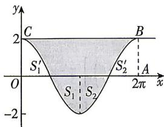
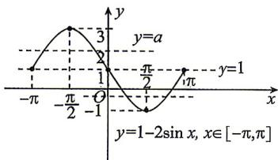

> [!faq]- 答案与解析
>
> > [!success]- **【答案】** $4\pi$
>
> > [!note]- **【解析】**
> > 根据题意作图, 如图所示.
> >
> > 
> >
> > 由余弦函数的性质可知，图形 $S_{1}^{\prime}$ 与 $S_{1}, S_{2}^{\prime}$ 与 $S_{2}$ 分别是两组对称图形，则有 $S_{1}^{\prime} = S_{1}, S_{2}^{\prime} = S_{2}$ ，阴影部分面积等于矩形OCBA的面积，根据图形可知 $OA = 2\pi, OC = 2$ ，矩形OCBA的面积为 $2 \times 2\pi = 4\pi$ ，即封闭图形的面积为 $4\pi$ 。
> >
> > 7【解】列表如下：
> >
> > <table><tr><td>x</td><td>-π</td><td>-π/2</td><td>0</td><td>π/2</td><td>π</td></tr><tr><td>sin x</td><td>0</td><td>-1</td><td>0</td><td>1</td><td>0</td></tr><tr><td>1-2sin x</td><td>1</td><td>3</td><td>1</td><td>-1</td><td>1</td></tr></table>
> >
> > 描点并将它们用光滑的曲线连接起来,如图所示.
> >
> > 
> >
> > (1)由图象可知,图象在直线 y=1 上方时 y>1, 在直线 y=1 下方时 y<1,
> > 所以①当 $x \in (-\pi, 0)$ 时, y>1;
> > - **②**：当 $x \in (0, \pi)$ 时, y<1.
> > (2) 如图所示, 当直线 y = a 与 $y = 1 - 2\sin x, x \in [-\pi, \pi]$ 的图象有两个交点时, $1 < a < 3$ 或 $-1 < a < 1$ , 所以实数 a 的取值范围
> > → 坑: 注意等号能否取到
> > 是 $(-1,1)\cup(1,3)$ .
> >
> > ## 刷易错
> >
> > ★易错点1 用图失误
