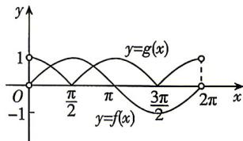

> [!faq]- 答案与解析
>
> > [!success]- **【答案】** $\pi$
>
> > [!note]- **【解析】**
> > 作出函数 $f(x) = \sin x$ 和 $g(x) = |\cos x|$ 在 $(0,2\pi)$ 上的图象如图所示. 故黑板: $g(x) = |\cos x|$ 的图象即保留 $y = \cos x$ 在 $x$ 轴上方的图象, 把 $x$ 轴下方的图象翻折到 $x$ 轴上方
> >
> > 
> >
> > 从图象上可得, 函数 $f(x)=\sin x$ 的图象和 $g(x)=|\cos x|$ 的图象在 $\left(0,\frac{\pi}{2}\right)$ ， $\left(\frac{\pi}{2},\pi\right)$ 内各有一个交点.
> > 当 $x \in \left(0, \frac{\pi}{2}\right)$ 时，由 $\sin x = |\cos x|$ 得 $\sin x=\cos x$ , 即 $\tan x=1$ , 得 $x=\frac{\pi}{4}$ ;
> > 当 $x \in \left(\frac{\pi}{2}, \pi\right)$ 时，由 $\sin x = |\cos x|$ 得 $\sin x = -\cos x$ , 即 $\tan x = -1$ , 得 $x = \frac{3\pi}{4}$ ,
> > 因此所有交点的横坐标之和为 $\frac{\pi}{4}+\frac{3\pi}{4}=\pi.$
> >
> > ## 刷提升
