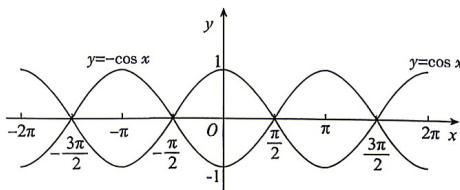

> [!faq]- 答案与解析
>
> > [!success]- **【答案】** C
>
> > [!note]- **【解析】**
> > C 【解析】在同一平面直角坐标系中作出函数 $y=\cos x$ 与函数 $y=-\cos x$ 的简图，易知选 C.
> >
> > 
> >
> > 易错警示 只考虑单个函数图象,或考虑不全面导致漏掉对称关系.
> >
> > ★ 易错点 2 画图错误
