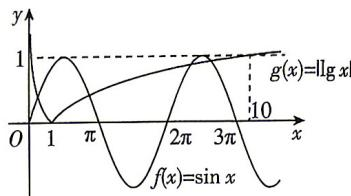

> [!faq]- 答案与解析
>
> > [!success]- **【答案】** D
>
> > [!note]- **【解析】**
> > D 【解析】根据题意,令 $g(x)=\lg x$ , 在同一平面直角坐标系内分别作出函数 $f(x)=\sin x$ 与函数 $g(x)=\lg x$ 的图象.
> >
> > 
> >
> > 在区间(0,1)内，函数 $g(x)=|\lg x|$ 单调递减，其图象与函数 $f(x)=\sin x$ 的图象有1个交点；
> > 在区间 $[1,+\infty)$ 内，函数 $f(x)=\sin x$ 的值域为 $[-1,1]$ ，函数 $g(x)=|\lg x|$ 单调递增且值域为 $[0,+\infty)$ ，
> > 又当x=10时， $g(10)=|\lg 10|=1$ ，结合图象可知，在区间 $[1,+\infty)$ 内，函数 $f(x)=\sin x$ 与函数 $g(x)=|\lg x|$ 的图象有3个交点.
> > 故方程 $f(x)=|\lg x|$ 的解的个数为4.
> > 故选D.
> >
> > 易错警示 用函数图象求零点(或交点)个数时,需要在作出简图的同时注意以下要点:一是函数图象增长趋势,最简单的就是函数的单调性;二是注意特值,尤其是零点和最值.把握以上两个要点,便可准确作图求出零点(或交点)个数.
