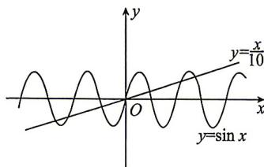

> [!faq]- 答案与解析
>
> > [!success]- **【答案】** 7
>
> > [!note]- **【解析】**
> > 作出函数 $y=\sin x$ 与 $y=\frac{x}{10}$ 的图象如图所示. 当 $x\geqslant4\pi$ 时, $\frac{x}{10}\geqslant\frac{4\pi}{10}>1\geqslant\sin x$ ; 当 $x=\frac{5\pi}{2}$ 时, $\sin x=\sin\frac{5\pi}{2}=1$ , $\frac{x}{10}=\frac{\pi}{4}<1$ . 从而当 x>0 时, 两函数图象有 3 个交点. 由对称性知, 当 x<0 时, 两函数图象有 3 个交点. 当 x=0 时, 两函数图象的交点为原点. 所以函数 $y=\sin x$ 与 $y=\frac{x}{10}$ 的图象共有 7 个交点, 即方程 $10\sin x=x$ 有 7 个根.
> >
> > 
> >
> > 易错警示 在画非三角函数 $f(x)$ 的图象时,均需确定 $|f(x)|\geqslant1$ 时x的值的范围,以便确定两个函数图象的位置关系.
