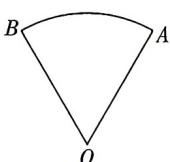

<!-- question-source:start -->
12. (多选)小夏同学在学习了任意角和弧度制的知识后,对家里的扇形瓷器盘产生了浓厚的兴趣,并临摹出该瓷器盘的大致形状,如图所示. 在扇形 OAB 中, $\angle AOB = \frac{\pi}{3}$ , OB = OA = 2,
则
A. $\angle AOB = 30^{\circ}$ B. $\widehat{AB}$ 的长为 $\frac{2\pi}{3}$ C. 扇形 OAB 的周长为 $\frac{2\pi}{3} + 4$ D. 扇形 OAB 的面积为 $\frac{4\pi}{3}$

<!-- question-source:end -->

![[Q00084178A1]]
