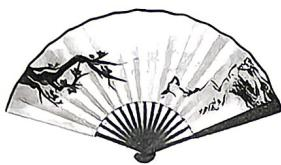
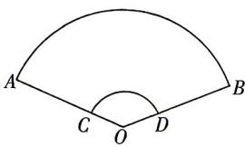

<!-- question-source:start -->
17.[黑龙江哈尔滨2026高一期末]如图,折扇是一种用竹木或象牙做扇骨,韧纸或绫绢做扇面的能折叠的扇子,如图①,其平面图是图②的扇形AOB,其中 $\angle AOB=135^{\circ},OA=3OC=3$ ,则扇面(曲边四边形ABDC)的面积是()

图①

图②

A. $3\pi$ B. $6\pi$ C. $\frac{8\pi}{3}$ D. $\frac{4\pi}{3}$

## 易错点 3 忽略对角的终边的讨论
<!-- question-source:end -->

![[Q00084183A1]]
