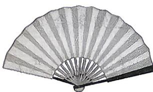

<!-- question-source:start -->
5.（多选）[陕西宝鸡2026高一月考]折扇可看作是从一个圆面中剪下的扇形制作而

成. 如图, 设扇形的面积为 $S_{1}$ , 其圆心角为 $\theta$ , 圆面中剩余部分的面积为 $S_{2}$ , 当 $S_{1}$ 与 $S_{2}$ 的比值为 $\frac{\sqrt{5} - 1}{2}$ 时, 扇面为“美观扇面”, 下列结论正确的是 ( )

建议用时:30 分钟 答案 P229

(参考数据: $\sqrt{5}\approx2.236$ )
A. $\frac{S_{1}}{S_{2}}=\frac{\theta}{2\pi-\theta}$ B. 若 $\frac{S_{1}}{S_{2}}=\frac{1}{2}$ ，且扇形的半径R=3，则 $S_{1}=2\pi$ C. 若扇面为“美观扇面”，则 $\theta\approx138^{\circ}$ D. 若扇面为“美观扇面”，扇形的半径 R=20，
则此时的扇形面积为 $200(3-\sqrt{5})$
<!-- question-source:end -->

![[Q00084190A1]]
