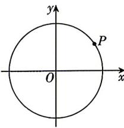

<!-- question-source:start -->
3.[浙江杭州高级中学2026高一月考]如图,一质点在半径为1的圆O上以点 $P\left(\frac{\sqrt{3}}{2},\frac{1}{2}\right)$ 为起点,按顺时针方向做匀速圆周

运动,角速度为 $\frac{\pi}{6}$ rad/s,5 s时到达点 $M(x_{0},y_{0})$ ,则 $y_{0}=$ ( )
A.-1 B. $-\frac{\sqrt{3}}{2}$ C. $-\frac{1}{2}$ D. $\frac{1}{2}$

## 题型2 三角函数值的符号
<!-- question-source:end -->

![[Q00084195A1]]
