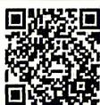

<!-- question-source:start -->
9. 已知 $\cos (508^{\circ} - \alpha) = \frac{12}{13}$ , 则 $\cos (212^{\circ} + \alpha) = \underline{\hspace{2cm}}$ .

# 5.4 三角函数的图象与性质

## 5.4.1 正弦函数、余弦函数的图象

视频讲解
拍照批改

## 刷基础

题型1 画图
<!-- question-source:end -->

![[Q00084254A1]]
