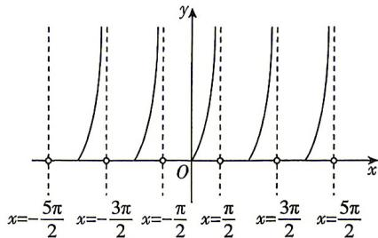

> [!faq]- 答案与解析
>
> > [!success]- **【答案】** D
>
> > [!note]- **【解析】**
> > D 【解析】 $f(x) = \tan x + |\tan x| = \left\{\begin{aligned}&2\tan x,x\in\left[k\pi,\frac{\pi}{2}+k\pi\right),k\in\mathbf{Z},\\ &0,x\in\left(-\frac{\pi}{2}+k\pi,k\pi\right),k\in\mathbf{Z},\end{aligned}\right.$ 作出 $f(x)$ 的图象如图所示.
> >
> > 
> >
> > 对于 A, $f(x)$ 的最小正周期为 $\pi$ , A 错误；
> > 对于 B, $f(x)$ 的值域为 $[0, +\infty)$ , B 错误；
> > 对于 C, $f(x)$ 的图象没有对称中心，C 错误；
> >
> > 对于 D, 不等式 $f(x) > 2\sqrt{3}$ ，即 $x \in \left[k\pi, \frac{\pi}{2} + k\pi\right) (k \in \mathbf{Z})$ 时， $2\tan x > 2\sqrt{3}$ ，得 $\tan x > \sqrt{3}$ ，解得 $\frac{\pi}{3} + k\pi < x < \frac{\pi}{2} + k\pi, k \in Z$ ，所以 $f(x) > 2\sqrt{3}$ 的解集为 $\left(\frac{\pi}{3} + k\pi, \frac{\pi}{2} + k\pi\right) (k \in \mathbf{Z})$ ，D 正确。
> >
> > 故选 **D**.
