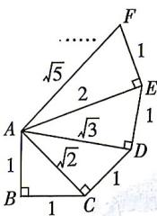

<!-- question-source:start -->
3. 希腊数学家泰特托斯（Theaetetus，公元前417—公元前369年）详细地讨论了无理数的理论，他通过如图来构造无理数 $\sqrt{2},\sqrt{3},\sqrt{5},\cdots$ ，则 $\sin\angle BAD=$ （）

$$
\frac {2 \sqrt {6} + 3 \sqrt {3}}{6}
$$

$$
\frac {2 \sqrt {6} - 3 \sqrt {3}}{6}
$$

$$
\frac {2 \sqrt {3} + \sqrt {6}}{6}
$$

$$
\frac {2 \sqrt {3} - \sqrt {6}}{6}
$$
<!-- question-source:end -->

![[Q00084349A1]]
