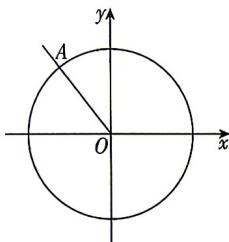

<!-- question-source:start -->
13.[江苏无锡2026高一学情调研]如图,在平面直角坐标系xOy中,角α的始边与x轴的非负半轴重合,将角α的终边按逆时针方向旋转 $\frac{\pi}{4}$ ,恰好与单位圆O相交于点 $A\left(-\frac{3}{5},\frac{4}{5}\right)$ .
(1) 求 $\cos\left(\alpha+\frac{\pi}{4}\right)$ 的值;
(2) 求 $\frac{1+2\sin\alpha\cos\alpha}{\cos^{2}\alpha-\sin^{2}\alpha}$ 的值.

## 刷易错

## 易错点1 忽略角的隐含范围导致增解
<!-- question-source:end -->

![[Q00084359A1]]
